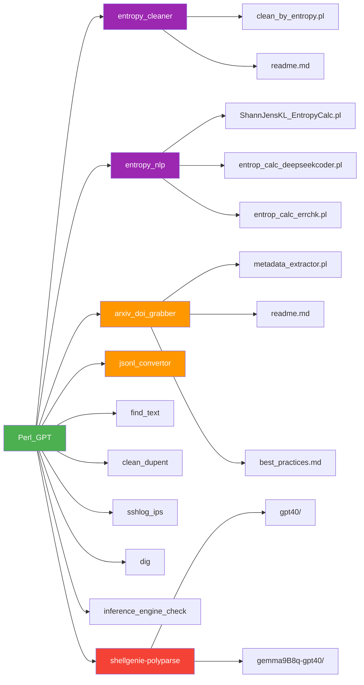
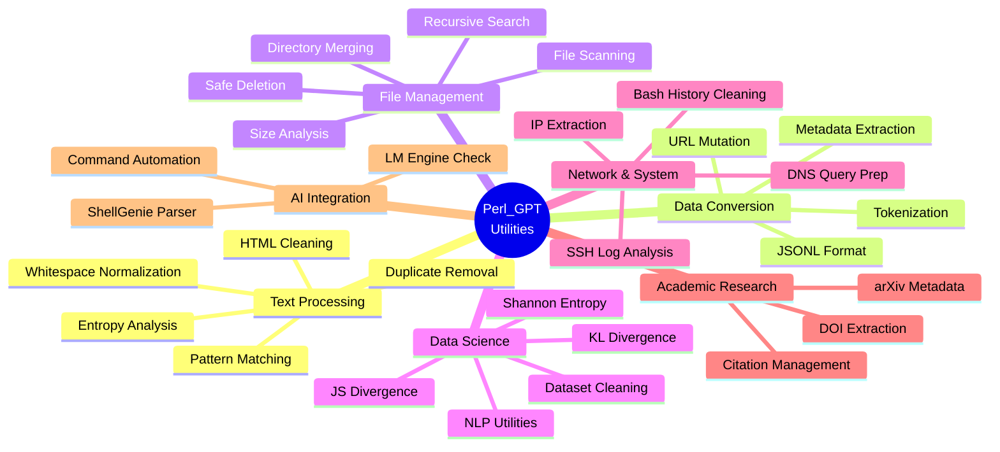
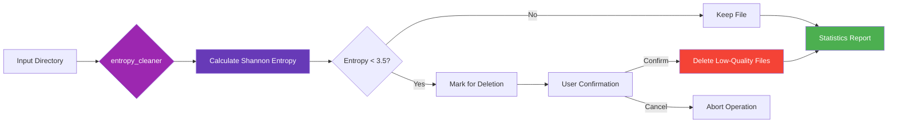
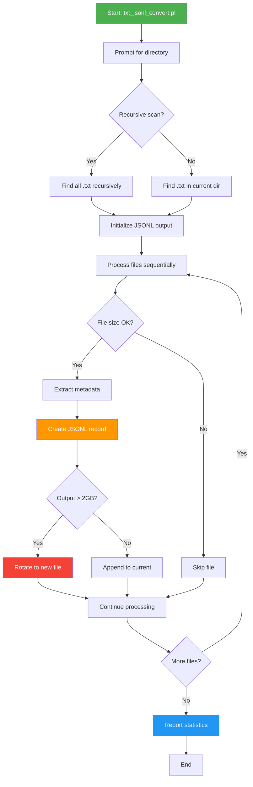
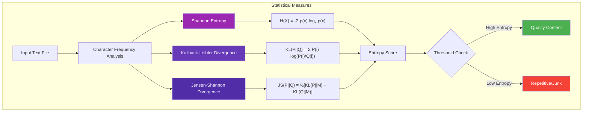
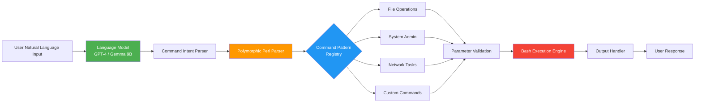
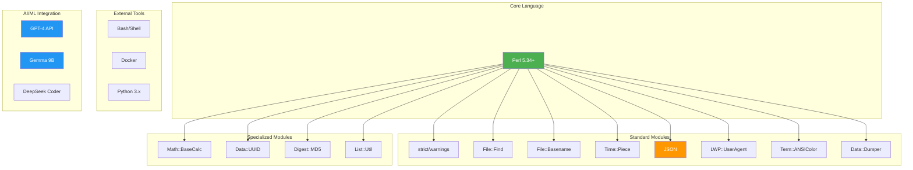
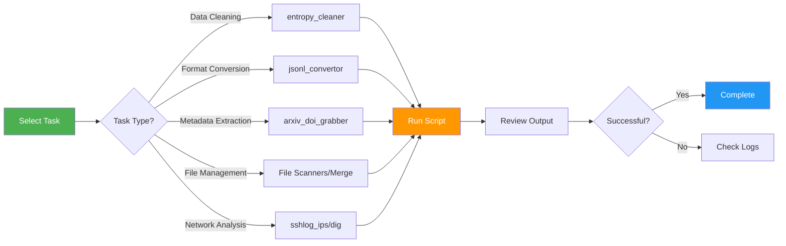

# Perl_GPT

> A comprehensive collection of AI-generated Perl utilities for text processing, data analysis, file management, and system automation.

[](LICENSE)
[](https://www.perl.org/)
[](/.github/workflows/)
[](/.perlcriticrc)
[](t/)
[](/cpanfile)
[](CONTRIBUTING.md)
[](https://github.com/danindiana/Perl_GPT/graphs/commit-activity)

## 📋 Table of Contents

- [Overview](#overview)
- [Quick Start](#quick-start)
- [Repository Structure](#repository-structure)
- [Functional Categories](#functional-categories)
- [Key Utilities](#key-utilities)
- [Technology Stack](#technology-stack)
- [Installation & Usage](#installation--usage)
- [Testing & Quality](#testing--quality)
- [Perl Use Cases](#perl-use-cases)
- [Contributing](#contributing)
- [Project Roadmap](#project-roadmap)

---

## Overview

**Perl_GPT** is a curated collection of 24+ Perl scripts and utilities, organized into specialized modules for various data processing, file management, and automation tasks. The repository demonstrates Perl's strengths in text processing while incorporating modern workflows for machine learning, NLP, and data science.

### Key Features

- 🔍 **Text Processing & Analysis** - Entropy calculations, duplicate removal, pattern matching
- 📊 **Data Format Conversion** - JSONL conversion for ML pipelines, metadata extraction
- 📁 **File Management** - Directory merging, file scanning, safe deletion utilities
- 🔬 **Academic Tools** - DOI/arXiv metadata extraction
- 🌐 **Network Utilities** - IP extraction, DNS query preparation
- 🤖 **AI Integration** - ShellGenie polymorphic parser with LM support
- 🧪 **Testing Framework** - Automated testing with Test::More
- 🔧 **Build Tools** - Makefile for automation, dependency management with cpanfile

---

## Quick Start

```bash
# 1. Clone the repository
git clone https://github.com/danindiana/Perl_GPT.git
cd Perl_GPT

# 2. Install dependencies (choose one method)
./install.sh                 # Interactive installer (recommended)
make install                 # Using Makefile
cpanm --installdeps .       # Direct cpanm installation

# 3. Verify installation
make deps-check              # Check dependencies
make syntax-check            # Verify all scripts
make test                    # Run test suite

# 4. Try a utility
cd tools
perl file_scanner.pl         # Interactive file scanner

# 5. Or use a specialized module
cd ../arxiv_doi_grabber
perl metadata_extractor.pl   # Extract academic metadata
```

---

## Repository Structure

```mermaid
graph TB
    Root[Perl_GPT Repository]

    Root --> Infra[Infrastructure<br/>Build & Config]
    Root --> Tools[tools/<br/>General Utilities]
    Root --> Modules[Specialized Modules<br/>10 Directories]
    Root --> Tests[t/<br/>Test Suite]

    Infra --> IF1[Makefile<br/>Build Automation]
    Infra --> IF2[cpanfile<br/>Dependencies]
    Infra --> IF3[install.sh<br/>Setup Script]
    Infra --> IF4[.perlcriticrc<br/>Code Quality]

    Tools --> T1[file_scanner.pl<br/>Search Files]
    Tools --> T2[merge_directories.pl<br/>Merge Dirs]
    Tools --> T3[Text Processing<br/>8 utilities]

    Modules --> EC[entropy_cleaner<br/>File Quality]
    Modules --> EN[entropy_nlp<br/>Statistical Analysis]
    Modules --> AG[arxiv_doi_grabber<br/>Metadata Extraction]
    Modules --> JC[jsonl_convertor<br/>Format Conversion]
    Modules --> FT[find_text<br/>File Discovery]
    Modules --> CD[clean_dupent<br/>Duplicate Removal]
    Modules --> SI[sshlog_ips<br/>IP Extraction]
    Modules --> DG[dig<br/>DNS Utilities]
    Modules --> IE[inference_engine_check<br/>LM Validation]
    Modules --> SG[shellgenie-polyparse<br/>Command Parser]

    Tests --> TE1[00-load.t<br/>Syntax Tests]
    Tests --> TE2[01-dependencies.t<br/>Module Tests]

    style Root fill:#e1f5ff
    style Infra fill:#c8e6c9
    style Tools fill:#fff4e1
    style Modules fill:#e8f5e9
    style Tests fill:#ffccbc
    style AG fill:#ffe0b2
    style JC fill:#ffe0b2
```



### Directory Organization



---

## Functional Categories



---

## Key Utilities

### Data Quality & Cleaning



**entropy_cleaner** - Removes low-entropy (repetitive/redundant) files using Shannon entropy calculations.

---

### Metadata Extraction Pipeline

```mermaid
sequenceDiagram
    participant U as User
    participant S as metadata_extractor.pl
    participant F as File System
    participant A as arXiv API
    participant D as DOI Service
    participant J as JSON Output

    U->>S: Provide directory path
    S->>F: Scan for .txt files
    F-->>S: Return file list

    loop For each file
        S->>F: Read file content
        S->>S: Extract DOI/arXiv IDs (regex)

        alt Has arXiv ID
            S->>A: Fetch metadata
            A-->>S: Return arXiv data
        end

        alt Has DOI
            S->>D: Fetch metadata
            D-->>S: Return DOI data
        end

        S->>J: Save *_extracted.json
    end

    S->>U: Processing complete + statistics

    style S fill:#FF9800,color:#fff
    style J fill:#4CAF50,color:#fff
```

**arxiv_doi_grabber** - Extracts academic metadata from documents and fetches detailed information from DOI/arXiv APIs.

---

### JSONL Conversion Workflow



**jsonl_convertor** - Converts text files to JSONL format with metadata for machine learning pipelines.

---

### Entropy Analysis Methods



**entropy_nlp** - Advanced statistical analysis using Shannon entropy, KL divergence, and JS divergence for NLP tasks.

---

### ShellGenie Architecture



**shellgenie-polyparse** - Advanced polymorphic command parser integrating AI language models for natural language shell automation.

---

## Technology Stack



---

## Installation & Usage

### Prerequisites

```bash
# Ensure Perl 5.34+ is installed
perl --version

# Install required CPAN modules
cpan install File::Find JSON LWP::UserAgent Term::ANSIColor Data::UUID
```

### Quick Start

```bash
# Clone the repository
git clone https://github.com/danindiana/Perl_GPT.git
cd Perl_GPT

# Example: Clean directory by entropy
cd entropy_cleaner
perl clean_by_entropy.pl

# Example: Convert text to JSONL
cd jsonl_convertor
perl txt_jsonl_convert.pl

# Example: Extract academic metadata
cd arxiv_doi_grabber
perl metadata_extractor.pl
```

### Common Workflows



---

## Docker Deployment 🐳

Run Perl_GPT in containerized environments for reproducible deployments.

### Quick Docker Start

```bash
# Build and start with Docker Compose (recommended)
docker-compose up -d perlgpt

# Or build manually
docker build -t perlgpt:latest .
docker run -it --rm perlgpt:latest

# Run specific utility
docker-compose exec perlgpt perl tools/file_scanner.pl

# Run examples
docker-compose exec perlgpt perl examples/entropy_analysis.pl
```

### Available Docker Services

| Service | Purpose | Command |
|---------|---------|---------|
| **perlgpt** | Main production service | `docker-compose up -d perlgpt` |
| **perlgpt-dev** | Development environment | `docker-compose up -d perlgpt-dev` |
| **perlgpt-test** | Testing environment | `docker-compose --profile test run perlgpt-test` |
| **perlgpt-worker** | Batch processing | `docker-compose --profile worker up perlgpt-worker` |

### Common Docker Operations

```bash
# Build the image
docker-compose build

# Start services
docker-compose up -d

# View logs
docker-compose logs -f perlgpt

# Execute commands
docker-compose exec perlgpt perl tools/file_scanner.pl

# Run tests
docker-compose --profile test run perlgpt-test

# Access shell
docker-compose exec perlgpt /bin/bash

# Stop services
docker-compose down
```

### Docker with Volumes

```bash
# Process files from local directory
docker run --rm \
  -v $(pwd)/input:/app/data/input \
  -v $(pwd)/output:/app/data/output \
  perlgpt:latest \
  perl jsonl_convertor/txt_jsonl_convert.pl

# Development with live code reload
docker-compose up -d perlgpt-dev
docker-compose exec perlgpt-dev /bin/bash
```

### Benefits of Docker Deployment

- ✅ **Reproducible** - Same environment every time
- ✅ **Isolated** - No conflicts with system Perl
- ✅ **Portable** - Run anywhere Docker runs
- ✅ **Scalable** - Easy to deploy multiple workers
- ✅ **Tested** - Pre-configured with all dependencies

**📖 Complete Guide**: See [docs/DOCKER.md](docs/DOCKER.md) for comprehensive Docker documentation including:
- Building custom images
- Volume management
- Environment configuration
- Troubleshooting
- Production deployment
- CI/CD integration

---

## Perl Use Cases

Perl is a versatile programming language that excels in numerous domains:

### Core Strengths

#### 1. Text Processing Excellence

- **Pattern Matching** - Advanced regex support for complex text search
- **Text Parsing** - Extract structured data from logs, configs, and documents
- **Text Transformation** - Format conversion and data normalization
- **String Manipulation** - Comprehensive built-in functions
- **Text Filtering** - Conditional data extraction
- **Report Generation** - Formatted output creation

#### 2. Data Processing & Analysis

- **Data Extraction** - Mining information from large datasets
- **Data Cleaning** - Removing duplicates, fixing formatting
- **Data Validation** - Ensuring data integrity
- **Data Transformation** - Converting between formats
- **Statistical Analysis** - Entropy calculations, frequency analysis

#### 3. System Administration

- **File Operations** - Automated copying, moving, organizing
- **Log Analysis** - Parsing system logs for insights
- **System Monitoring** - Health checks and alerting
- **Configuration Management** - Automated config updates
- **Task Scheduling** - Cron-based automation
- **Backup Management** - Automated backup routines

#### 4. Web & Network Operations

- **Web Scraping** - HTML parsing and data extraction
- **API Integration** - REST/SOAP client implementations
- **Network Utilities** - Socket programming, protocol handling
- **Data Mining** - Extracting insights from web sources

#### 5. Database Operations

- **Database Interactions** - DBI module for SQL operations
- **Data Migration** - Moving data between systems
- **ETL Pipelines** - Extract, Transform, Load workflows

#### 6. Scientific Computing

- **Bioinformatics** - Genomic sequence analysis
- **Natural Language Processing** - Text tokenization, analysis
- **Academic Research** - Metadata extraction, citation management

### Text Processing Capabilities

Perl's regex engine and text handling make it ideal for:

1. **Pattern Matching** - Identify complex patterns in text
2. **Text Parsing** - Extract structured data from unstructured sources
3. **Text Transformation** - Reformat and normalize data
4. **Data Extraction** - Mine specific information from large files
5. **Text Cleaning** - Remove unwanted characters and normalize whitespace
6. **String Manipulation** - Concat, split, trim, case conversion
7. **Text Comparison** - Diff operations and change detection
8. **Text Substitution** - Find-and-replace with regex
9. **Report Generation** - Create formatted output
10. **Log File Analysis** - Extract metrics and statistics
11. **NLP Tasks** - Tokenization, stemming, POS tagging
12. **Text Validation** - Ensure data meets specifications

### Data Scraping Excellence

Perl excels at web and data scraping:

1. **Web Page Scraping** - HTML parsing and extraction
2. **API Scraping** - JSON/XML data retrieval
3. **Social Media** - Trend analysis and user data
4. **E-commerce** - Price monitoring and product data
5. **Academic Sources** - Research paper metadata
6. **Government Data** - Public records and statistics
7. **News Articles** - Content aggregation
8. **Real Estate** - Property listing data
9. **Financial Data** - Stock prices, market data
10. **Weather Data** - Forecasts and historical data

### Automation & Scripting

Perl's concise syntax enables powerful automation:

1. **File & Directory Operations** - Bulk file management
2. **Data Backup & Archiving** - Automated backup workflows
3. **Log Analysis** - Real-time monitoring and alerting
4. **Configuration Management** - Config deployment
5. **Software Deployment** - Package installation automation
6. **Email Automation** - Automated email processing
7. **Network Automation** - Device configuration
8. **Image Processing** - Batch image operations
9. **Data Migration** - System-to-system transfers
10. **Testing Automation** - Unit and integration tests

---

## Project Structure Details

### Root-Level Utilities (17 Files)

| Script | Purpose | Input | Output |
|--------|---------|-------|--------|
| `file_scanner.pl` | Keyword-based file search | Keywords, directory | Matched files list |
| `file_scannerv2.pl` | Enhanced file scanner | Keywords, directory | Improved results |
| `file_scan_recursdir.pl` | Recursive scanning | Directory path | Recursive file list |
| `file_size_scanner.pl` | File size analysis | Directory path | Size statistics |
| `merge_dirs_v2.pl` | Directory merging | Source/dest paths | Merged directory |
| `concat_chunks.pl` | Text concatenation | Directory, chunk size | Chunked files |
| `remove_repeats_html.pl` | HTML duplicate removal | HTML file | Cleaned HTML |
| `remove_whitespace.pl` | Whitespace cleanup | Text file | Normalized text |
| `perl_mutator.pl` | URL to UUID conversion | URL file | UUID output |
| `clean_bash_history.pl` | Bash history sanitization | History file | Cleaned history |
| `file_deletion_tool.pl` | Safe file deletion | File paths | Confirmation + delete |

### Specialized Modules

#### entropy_cleaner/
- **Purpose**: File quality assessment via entropy
- **Key Script**: `clean_by_entropy.pl`
- **Threshold**: 3.5 (configurable)
- **Output**: Deletion confirmation + statistics

#### entropy_nlp/
- **Purpose**: Advanced statistical entropy analysis
- **Methods**: Shannon, KL Divergence, JS Divergence
- **Scripts**:
  - `ShannJensKL_EntropyCalc.pl` - Full suite
  - `entrop_calc_deepseekcoder.pl` - DeepSeek optimized
  - `entrop_calc_errchk.pl` - Error-checked version

#### arxiv_doi_grabber/
- **Purpose**: Academic metadata extraction
- **Key Script**: `metadata_extractor.pl`
- **APIs**: arXiv, DOI resolution services
- **Output**: JSON metadata files

#### jsonl_convertor/
- **Purpose**: ML pipeline data preparation
- **Key Script**: `txt_jsonl_convert.pl`
- **Features**: Auto-rotation at 2GB, metadata inclusion
- **Format**: JSONL (JSON Lines)

#### shellgenie-polyparse/
- **Purpose**: AI-powered shell automation
- **Architecture**: Polymorphic command parser
- **LM Support**: GPT-4, Gemma 9B
- **Deployment**: Docker containerization

---

## Testing & Quality

### Running Tests

```bash
# Run all tests
make test

# Run tests with verbose output
make test-verbose

# Check syntax of all scripts
make syntax-check

# Run Perl::Critic code quality checks
make critic

# Generate test coverage report
make coverage
```

### Test Suite Structure

```
t/
├── 00-load.t           # Syntax verification for all scripts
├── 01-dependencies.t   # Dependency availability checks
└── ...                 # Module-specific tests
```

### Code Quality Standards

All code in this repository follows:

- **Perl::Critic** severity level 3 or higher
- **Strict and warnings** pragmas enabled
- **Test coverage** target of 70%+ for new code
- **POD documentation** for all modules
- **Consistent naming** conventions

### Continuous Integration

GitHub Actions CI/CD pipeline automatically:

- Tests on multiple Perl versions (5.30, 5.32, 5.34, 5.36, 5.38)
- Runs on Ubuntu and macOS
- Performs syntax checking
- Runs Perl::Critic analysis
- Validates documentation

See [`.github/workflows/`](.github/workflows/) for pipeline configuration.

---

## Contributing

Contributions are welcome! Please see [CONTRIBUTING.md](CONTRIBUTING.md) for detailed guidelines.

### Quick Contribution Guide

1. **Fork the repository** and create a feature branch
2. **Follow coding standards** defined in CONTRIBUTING.md
3. **Write tests** for new functionality
4. **Run quality checks**: `make all`
5. **Update documentation** as needed
6. **Submit a pull request** with clear description

### Code Style

- Use `strict` and `warnings` pragmas
- Follow naming conventions in CONTRIBUTING.md
- Include POD documentation
- Add comprehensive error handling
- Write unit tests for new features

See [CONTRIBUTING.md](CONTRIBUTING.md) for complete guidelines.

---

## Project Roadmap

### Completed ✅

- [x] Core utility scripts for file management
- [x] Entropy-based text analysis tools
- [x] Academic metadata extraction (arXiv/DOI)
- [x] JSONL conversion for ML pipelines
- [x] Repository-wide dependency management (cpanfile)
- [x] Automated installation script
- [x] Makefile for build automation
- [x] Test framework with Test::More
- [x] Code quality standards (Perl::Critic)
- [x] CI/CD pipeline with GitHub Actions
- [x] Comprehensive documentation
- [x] **Updated dependencies to latest versions**
- [x] **Expanded test coverage for core modules**
- [x] **Docker containers for reproducible environments**
- [x] **Example scripts for common use cases**
- [x] **Docker Compose multi-service setup**

### In Progress 🚧

- [ ] Consolidating entropy_nlp variants
- [ ] Performance benchmarking suite
- [ ] Expanding test coverage to 80%+

### Planned 📋

#### Short Term
- [ ] Add pre-commit hooks for code quality
- [ ] Create unified documentation site
- [ ] Extend CI/CD to all modules
- [ ] Add integration tests for all major utilities
- [ ] Performance profiling tools

#### Medium Term
- [ ] Complete ShellGenie polymorphic parser implementation
- [ ] Add support for parallel processing
- [ ] Create interactive configuration tool
- [ ] Package select modules for CPAN distribution
- [ ] Add monitoring and logging framework

#### Long Term
- [ ] Web interface for common utilities
- [ ] Plugin architecture for extensibility
- [ ] Machine learning model integration
- [ ] Cloud deployment templates (AWS, GCP, Azure)
- [ ] Multi-language support (Python/Perl interop)

### Community Requests

Have a feature request? [Open an issue](https://github.com/danindiana/Perl_GPT/issues) on GitHub!

---

## License

This project is licensed under the GNU General Public License v3.0 - see the [LICENSE](LICENSE) file for details.

---

## Acknowledgments

- Generated with assistance from GPT-4, DeepSeek Coder, and other AI models
- Built on Perl's robust text processing foundation
- Community CPAN modules for extended functionality

---

## Quick Reference

### Most Used Scripts

```bash
# File management tools
perl tools/file_scanner.pl              # Search files by keywords
perl tools/merge_directories.pl         # Merge directories safely

# Data quality and cleaning
perl entropy_cleaner/clean_by_entropy.pl  # Clean low-entropy files

# Format conversion
perl jsonl_convertor/txt_jsonl_convert.pl # Convert to JSONL for ML

# Academic research
perl arxiv_doi_grabber/metadata_extractor.pl  # Extract DOI/arXiv metadata

# Network utilities
perl sshlog_ips/ip_extractor.pl         # Extract IPs from logs
perl find_text/find_text_files.pl       # Find all text files
```

### Dependency Installation

```bash
# Recommended: Use the automated installer
./install.sh

# Or use Makefile
make install

# Or install manually with cpanm
cpanm --installdeps .

# Or use cpan directly
cpan install File::Find File::Basename File::Spec Time::Piece \
             JSON LWP::UserAgent Term::ANSIColor Data::Dumper \
             List::Util Math::BaseCalc Data::UUID Digest::MD5
```

---

**Maintained by**: [danindiana](https://github.com/danindiana)
**Repository**: [Perl_GPT](https://github.com/danindiana/Perl_GPT)
**Last Updated**: November 2025
