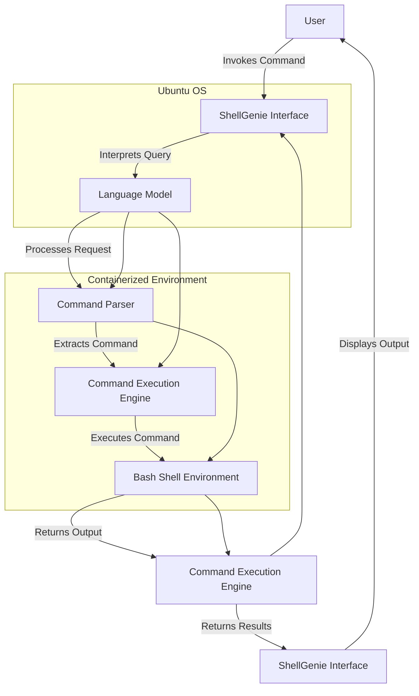

## ShellGenie Command Parser: A Polymorphic Perl Solution

This document explores the design of a command parser component for ShellGenie, inspired by polymorphic Perl programming.

### Core Concept:

The ShellGenie command parser will leverage Perl's dynamic typing and powerful regular expression capabilities to achieve polymorphism. Instead of rigidly defining fixed structures for commands, we'll define **parse patterns**, essentially regular expressions with attached code blocks. These patterns will match incoming user commands and execute the associated code block, dynamically handling various command formats.

### Benefits:

* **Extensibility:** Adding new commands is as simple as defining a new parse pattern and its corresponding action. No need for recompilation or complex code modifications.
* **Flexibility:** Handle variations in command syntax gracefully through wildcard patterns and capturing groups within regular expressions.
* **Code Reuse:** Leverage Perl's powerful modules and libraries within the code blocks, allowing for concise and efficient command implementations.

### Implementation Details:

#### 1. Command Registry:
A central repository to store registered parse patterns and their associated actions. Each entry in the registry will consist of:

* **Pattern:** A regular expression representing the command syntax.
* **Action:** A Perl code block that will be executed when the pattern matches. This code block can perform tasks like argument extraction, parameter validation, and finally invoking the desired system command.

#### 2. Parsing Loop:
The parser will continuously iterate over incoming user commands:

* Match the command against each registered pattern in the registry using Perl's `=~` operator.
* If a match is found, execute the corresponding action, passing captured arguments to the code block.
* Handle cases where no match is found by either prompting the user for clarification or issuing an error message.

#### 3. Perl Code Blocks:
These blocks will provide fine-grained control over command processing:

* **Argument Extraction:** Utilize Perl's regular expressions and capturing groups to extract specific arguments from the matched command string.
* **Parameter Validation:** Implement custom logic to validate the extracted arguments against expected types or ranges.
* **Command Execution:** Use Perl modules like `system()` or `IO::Shell` to execute the appropriate system commands, passing validated arguments as necessary.

#### 4. Error Handling and Logging:
Incorporate robust error handling mechanisms within the code blocks to gracefully handle unexpected situations:

* Catch potential exceptions during argument parsing, validation, or command execution.
* Log errors and relevant context information for debugging purposes.

### Example:

Let's say we want to define a command `ls -l` for listing files with detailed information. The corresponding Perl code block might look like this:

```perl
sub handle_ls_command {
    my ($pattern, $match) = @_;

    # Extract arguments from matched pattern
    my $options = $match[1]; # e.g., "-l"

    # Execute ls command with extracted options
    system("ls", $options);
}

push(@command_registry, {
    Pattern => qr/ls\s+(.+)/,
    Action => 'handle_ls_command'
});
```

This code snippet demonstrates how a simple parse pattern can be associated with a Perl function that handles the command execution.

### Conclusion:

Utilizing polymorphic Perl for ShellGenie's command parser offers a powerful and flexible solution. It allows for extensibility, graceful handling of variations in command syntax, and efficient code reuse through Perl's rich ecosystem. This approach aligns well with ShellGenie's goal of providing a dynamic and user-friendly command-line experience within a containerized environment.

### ShellGenie Command Parser Architecture



### File Tree Structure (Example):

```
shellgenie-parser/
├── lib/
│   └── ShellGenieParser.pm  # Main parser module
├── test/
│   └── t/*.t                # Test files for individual command parsers
├── examples/                # Examples of defining new command parsers
│   └── example_commands.pm 
└── docs/                    # Documentation for the component
    └── README.md            
```

### Explanation:

* **`lib/`**: Contains the core Perl module files.
    * **`ShellGenieParser.pm`**: This file would house the main logic for:
        * Managing the command registry (hash or similar data structure)
        * Implementing the parsing loop
        * Handling error conditions and logging

* **`test/`**: Holds unit tests to ensure the parser functions correctly:
    * **`t/*.t`**: Individual test files for each defined command pattern. This allows for focused testing and easier maintenance.

* **`examples/`**: Provides illustrative examples of how to define new command parsers using the `ShellGenieParser` module.

* **`docs/`**: Houses documentation for the component, including:
    * **`README.md`**: A brief overview of the parser's functionality, usage instructions, and contributing guidelines.
    * Additional documentation files as needed (API documentation, etc.).
