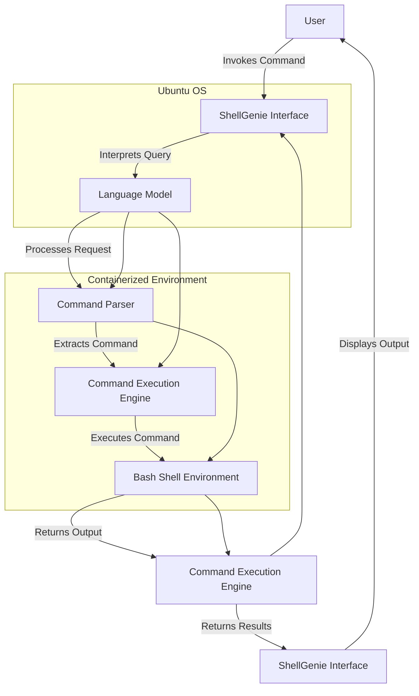

To expand the exploration of the command parser component using a polymorphic Perl parser as a conceptual basis for the ShellGenie system, we can delve into various aspects, including design principles, functionality, and integration. Here's a detailed exploration:

### Overview of the Command Parser

The command parser in the ShellGenie system is a critical component that interprets commands issued by the user and translates them into actions executable by the Bash shell environment. Using a polymorphic Perl parser enhances the flexibility and adaptability of the command parser, allowing it to handle a wide variety of command structures and user inputs.

### Design Principles

1. **Polymorphism**: The parser can interpret different command syntaxes and structures, allowing it to adapt to various user input styles.
2. **Extensibility**: Easy to extend with new command types and syntax rules without significant changes to the core logic.
3. **Robust Error Handling**: Ability to detect and gracefully handle syntax errors or unsupported commands.
4. **Security**: Ensure that the parsed commands are sanitized to prevent injection attacks and unauthorized access.

### Functionality

1. **Command Recognition**: Identify and classify the command type (e.g., file operations, system monitoring, networking).
2. **Syntax Parsing**: Break down the command into its constituent parts (e.g., command, options, arguments).
3. **Validation**: Check the command against predefined rules and permissible actions.
4. **Execution Preparation**: Format the command for execution by the Bash shell, handling any necessary transformations.

### Integration with ShellGenie System

1. **User Input Handling**: The command parser receives user commands from the ShellGenie Interface.
2. **Language Model Interaction**: The language model processes the user's natural language query and converts it into a structured command format understood by the parser.
3. **Command Execution Engine**: After parsing, the command is passed to the Command Execution Engine, which interacts with the Bash shell environment.

### Polymorphic Perl Parser Implementation

1. **Base Class and Derived Classes**: Use a base Perl parser class with generic parsing methods. Create derived classes for specific command types (e.g., file operations, networking).
    ```perl
    package BaseParser;
    sub new {
        my $class = shift;
        my $self = {};
        bless $self, $class;
        return $self;
    }

    sub parse {
        my ($self, $command) = @_;
        # Generic parsing logic
    }
    ```

2. **Derived Class Example**:
    ```perl
    package FileParser;
    use base 'BaseParser';

    sub parse {
        my ($self, $command) = @_;
        # File-specific parsing logic
    }
    ```

3. **Command Recognition and Delegation**:
    ```perl
    package CommandParser;
    use FileParser;
    use NetworkParser;

    sub parse_command {
        my ($command) = @_;
        if ($command =~ /file/i) {
            my $parser = FileParser->new();
            return $parser->parse($command);
        } elsif ($command =~ /network/i) {
            my $parser = NetworkParser->new();
            return $parser->parse($command);
        } else {
            # Default parsing
            my $parser = BaseParser->new();
            return $parser->parse($command);
        }
    }
    ```

### Integration in ShellGenie System



### Example Workflow

1. **User Input**: The user enters a command through the ShellGenie Interface.
2. **Language Model Processing**: The language model interprets the natural language command and converts it into a structured format.
3. **Command Parsing**: The Command Parser identifies the command type and uses the appropriate derived parser class to parse and validate the command.
4. **Execution**: The Command Execution Engine receives the parsed command and interacts with the Bash Shell Environment to execute it.
5. **Output Handling**: The output from the Bash Shell Environment is returned through the Command Execution Engine to the ShellGenie Interface, which displays it to the user.

By leveraging a polymorphic Perl parser, the ShellGenie system can efficiently handle a diverse range of commands, ensuring flexibility, extensibility, and robust performance.
