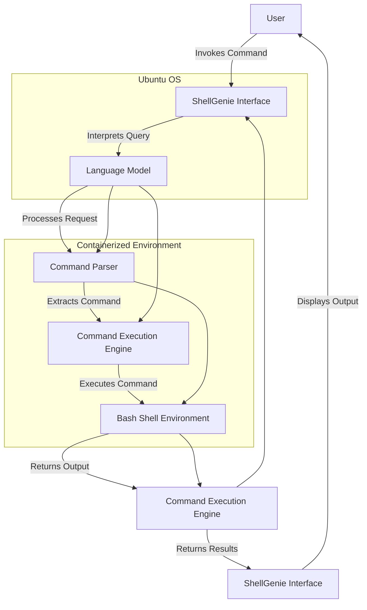

To expand the exploration of the command parser component using a polymorphic Perl parser as a conceptual basis for the ShellGenie system, we can delve into various aspects, including design principles, functionality, and integration. Here's a detailed exploration:

### Overview of the Command Parser

The command parser in the ShellGenie system is a critical component that interprets commands issued by the user and translates them into actions executable by the Bash shell environment. Using a polymorphic Perl parser enhances the flexibility and adaptability of the command parser, allowing it to handle a wide variety of command structures and user inputs.

### Design Principles

1. **Polymorphism**: The parser can interpret different command syntaxes and structures, allowing it to adapt to various user input styles.
2. **Extensibility**: Easy to extend with new command types and syntax rules without significant changes to the core logic.
3. **Robust Error Handling**: Ability to detect and gracefully handle syntax errors or unsupported commands.
4. **Security**: Ensure that the parsed commands are sanitized to prevent injection attacks and unauthorized access.

### Functionality

1. **Command Recognition**: Identify and classify the command type (e.g., file operations, system monitoring, networking).
2. **Syntax Parsing**: Break down the command into its constituent parts (e.g., command, options, arguments).
3. **Validation**: Check the command against predefined rules and permissible actions.
4. **Execution Preparation**: Format the command for execution by the Bash shell, handling any necessary transformations.

### Integration with ShellGenie System

1. **User Input Handling**: The command parser receives user commands from the ShellGenie Interface.
2. **Language Model Interaction**: The language model processes the user's natural language query and converts it into a structured command format understood by the parser.
3. **Command Execution Engine**: After parsing, the command is passed to the Command Execution Engine, which interacts with the Bash shell environment.

### Polymorphic Perl Parser Implementation

1. **Base Class and Derived Classes**: Use a base Perl parser class with generic parsing methods. Create derived classes for specific command types (e.g., file operations, networking).
    ```perl
    package BaseParser;
    sub new {
        my $class = shift;
        my $self = {};
        bless $self, $class;
        return $self;
    }

    sub parse {
        my ($self, $command) = @_;
        # Generic parsing logic
    }
    ```

2. **Derived Class Example**:
    ```perl
    package FileParser;
    use base 'BaseParser';

    sub parse {
        my ($self, $command) = @_;
        # File-specific parsing logic
    }
    ```

3. **Command Recognition and Delegation**:
    ```perl
    package CommandParser;
    use FileParser;
    use NetworkParser;

    sub parse_command {
        my ($command) = @_;
        if ($command =~ /file/i) {
            my $parser = FileParser->new();
            return $parser->parse($command);
        } elsif ($command =~ /network/i) {
            my $parser = NetworkParser->new();
            return $parser->parse($command);
        } else {
            # Default parsing
            my $parser = BaseParser->new();
            return $parser->parse($command);
        }
    }
    ```

### Integration in ShellGenie System



### Example Workflow

1. **User Input**: The user enters a command through the ShellGenie Interface.
2. **Language Model Processing**: The language model interprets the natural language command and converts it into a structured format.
3. **Command Parsing**: The Command Parser identifies the command type and uses the appropriate derived parser class to parse and validate the command.
4. **Execution**: The Command Execution Engine receives the parsed command and interacts with the Bash Shell Environment to execute it.
5. **Output Handling**: The output from the Bash Shell Environment is returned through the Command Execution Engine to the ShellGenie Interface, which displays it to the user.

By leveraging a polymorphic Perl parser, the ShellGenie system can efficiently handle a diverse range of commands, ensuring flexibility, extensibility, and robust performance.

Explain how the ShellGenie command parser receives input from a language model (either a model running on local hardware such as ollama, llama.cpp, or via an API such as OpenAI's Core API endpoint).

## How ShellGenie Command Parser Receives Input from a Language Model

### Overview

The ShellGenie system is designed to interface with language models to interpret user queries and convert them into actionable commands executed in a Bash shell environment. The command parser component plays a crucial role in this process, extracting and processing commands from the interpreted language model output. This document details how ShellGenie receives input from a language model running either on local hardware (e.g., ollama, llama.cpp) or via an API (e.g., OpenAI's Core API endpoint).

### Components and Workflow

1. **User Interface:**
   - **Input:** The user enters a command or query through the ShellGenie interface.
   - **Output:** The user receives the results or output from the executed command.

2. **ShellGenie Interface:**
   - **Function:** Acts as the intermediary between the user and the language model.
   - **Tasks:**
     - Receives user input.
     - Sends the input to the language model.
     - Receives the interpreted query from the language model.
     - Forwards the interpreted query to the command parser.

3. **Language Model:**
   - **Function:** Interprets the user's natural language input and translates it into a structured command format.
   - **Tasks:**
     - Processes the user query.
     - Generates an interpreted command string.
     - Sends the interpreted command to the ShellGenie interface.

4. **Command Parser:**
   - **Function:** Extracts and validates the command from the interpreted query.
   - **Tasks:**
     - Receives the interpreted command string from the ShellGenie interface.
     - Matches the command against registered parse patterns.
     - Extracts command arguments and parameters.
     - Validates and prepares the command for execution.

5. **Command Execution Engine:**
   - **Function:** Executes the parsed and validated command in a Bash shell environment.
   - **Tasks:**
     - Executes the command.
     - Captures the output.
     - Returns the output to the ShellGenie interface.

6. **Bash Shell Environment:**
   - **Function:** Provides the execution environment for the commands.
   - **Tasks:**
     - Executes commands passed by the Command Execution Engine.
     - Returns results or output.

### Detailed Interaction Flow

1. **User Input:**
   - The user enters a command (e.g., "list all files in the current directory").
   
2. **ShellGenie Interface:**
   - Receives the user input.
   - Sends the input to the language model for interpretation.

3. **Language Model Processing:**
   - If using a local model (e.g., ollama, llama.cpp):
     - The ShellGenie interface sends the input to the local model running on the hardware.
     - The local model processes the input and generates an interpreted command string (e.g., "ls -la").
   - If using an API (e.g., OpenAI's Core API):
     - The ShellGenie interface sends the input to the API endpoint.
     - The API processes the input and returns an interpreted command string.

4. **Receiving Interpreted Command:**
   - The ShellGenie interface receives the interpreted command string from the language model.
   - Forwards the interpreted command to the command parser.

5. **Command Parsing:**
   - The command parser matches the interpreted command string against registered parse patterns.
   - Extracts and validates command arguments (e.g., options for the `ls` command).
   - Prepares the command for execution.

6. **Command Execution:**
   - The Command Execution Engine receives the parsed and validated command.
   - Executes the command in the Bash shell environment.
   - Captures the output.

7. **Output Handling:**
   - The Bash shell environment returns the output of the command.
   - The Command Execution Engine sends the output back to the ShellGenie interface.
   - The ShellGenie interface displays the output to the user.

### Example Interaction:

1. **User:** "Show me the files in this directory."
2. **ShellGenie Interface:** Sends query to the language model.
3. **Language Model:** Interprets query and returns "ls -la".
4. **ShellGenie Interface:** Forwards "ls -la" to the command parser.
5. **Command Parser:** Matches pattern, extracts options, validates command.
6. **Command Execution Engine:** Executes "ls -la" in Bash.
7. **Bash Shell Environment:** Returns file list.
8. **ShellGenie Interface:** Displays file list to the user.

This detailed interaction flow ensures that the ShellGenie command parser effectively receives and processes input from a language model, whether running locally or accessed via an API, providing a seamless user experience.
